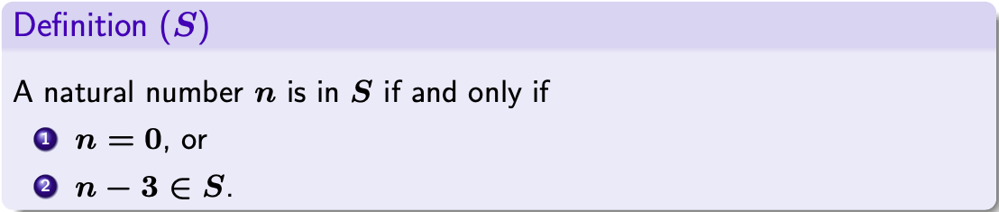
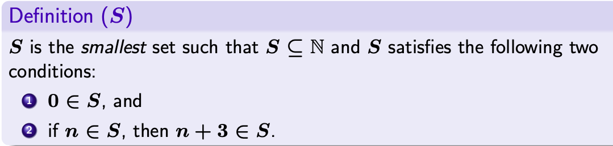
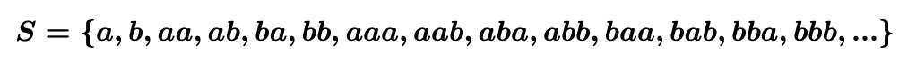

# Inductive Definition(1)

## Inductive definition :
- Top-down
- Bottom-up
- Rules of inference

## Top-down
- Example (Top-down)

~~~<python>
def check(n):
  if n = 0 : return True
  else : return check(n-3)
~~~

## Bottom-up
- Dynamic programming

Bottom-up : 직관적으로 구할 수 있는 작은 해를 구한 후 이를 이용하여 더 큰 문제를 해결하는 방식
- Example 
정수 n이 주어졌을 때 1,2,3의 합으로 방법의 수를 구한다고 가정하면
~~~<python>
n=1 -> 1가지
n=2 -> 2가지
n=3 -> 4가지
n=4 -> 7가지
n=5 -> 13가지
...
~~~
여기서 d[n] = d[n-3] + d[n-2] + d[n-1] 라는 점화식을 도출할 수 있다. 

반대로 top-down방식이라면 
예를 들어 d[7]를 구하기 위해 d[6],d[5],d[4]를 구하고 
그 d[6]을 구하기 위해 d[5],d[4],d[3]를 구해야한다. 
... 
중복된 해를 구하는 일이 많아져 낭비 발생. 

## Rules of Inference
An inference rule is of the form :

$$\frac{A}{B}$$

$${A}$$ : hypothesis(가정) 
$${B}$$ : conclusion(결론) 
$$\overline{B}$$ : axiom(명제) 
$$\frac{A \ B}{C}$$ : A 와 B 모두 참일때 C도 참 

## Exercises
- What set is defined by the following inductive rules?

S = { 3, 6, 9, 12, ... }

- What set is defined by the following inductvie rules?

S = { (), (()), ()(), (())(()), ... }

- Define the following set as rules of inference :

$$ \overline{a} \quad \overline{b} \quad \frac{a \ b}{ab} $$

- Define the following set as rules of inference :

$$ \overline{b} \quad \frac{x}{axb} $$