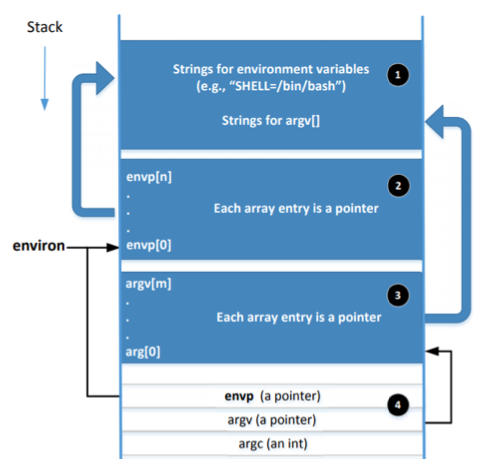
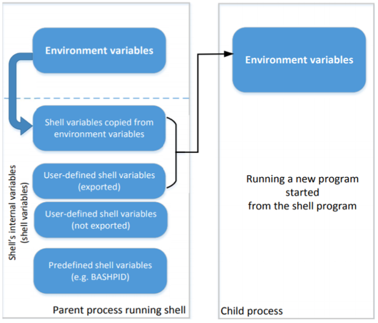
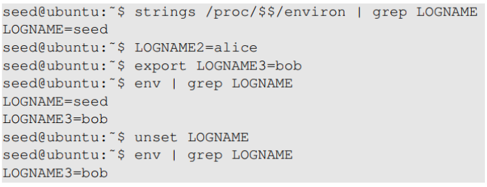

# Environment Variables

## Environment variables

- 어떤 프로세스가 동작할떄 동작하는 환경 요소 중 하나 (동적 변수)

- ex) PATH (program이 어디있는지 찾는데 사용되는 환경 변수)

## How does a process get environment variables?
1. fork()를 사용하여 new process를 생성할 떄, child process가 parent process의 환경 변수를 이어받는다.

2. 만약 process가 새로운 program을 동작시켰다면,
 그 프로그램이 execve() system call을 사용했다면 메모리 공간이 덮여씌워지고 전의 모든 환경 변수가 사라진다.
 execve()를 통해 특정 방법을 불러오면 한 process에서 다른 process로 환경 변수를 옮길 수 있다.

 ex) int execve(const char *filename, <B>char *const envp[]</B>)
 
## Memory Location for Environment variables

- envp와 environ의 point는 처음에 같은 장소를 가리킨다.

- envp는 오직 main function에서만 접근할 수 있는 반면, environ은 전역 변수이다.

- 환경 변수에서 변화가 생겼을 떄, 그 환경 변수가 저장된 장소는 heap으로 옮겨진다.

- 이러한 예에서 environ은 전역 변수이기에 변하지만 envp는 변하지 않는다.

## Shell variables & Environment variables

- 사람들은 shell변수와 환경 변수가 같다고 생각하지만 사실은 다르다.

- shell variable : 
    - 쉘 내에서 사용하는 내부 변수
    - 쉘은 사용자가 환경 변수를 생성, 할당, 삭제를 할 수 있게해주는 <B>built-in</B> 명령어를 제공한다.
    - ex) FOO=bar (FOO라는 환경 변수 생성), echo $FOO 

- shell 프로그램이 시작할 때 환경 변수들을 복사하여 쉘 변수로 가져온다.

- 쉘 변수의 내용이 변경된다고 해서 전역 변수에 그 내용이 반영되는 것은 아니다.

- 위 그림은 쉘 변수가 child process의 환경 변수에 어떻게 영향을 주는 지 보여준다.

- 또한 parent shell의 환경 변수가 어떻게 child procces의 환경 변수가 되는지 보여준다.

- 즉, 사용자가 쉘 변수를 export한 것과 환경 변수를 쉘 변수로 복사한 것이 child process에 상속된다.

    - 

    - env는 shell이 child process를 생성하게 만든다.

    - 위 코드에서 볼 수 있듯이 env | grep LOGNAME 명령어 이후에는 child process에 진입한 것이다.

    - 따라서 shell에 copy된 Environment variable <B>LOGNAME</B>과 export한 shell variable <B>LOGNAME3</B>만 출력 된것을 확인할 수 있다.

    - LOGNAME2는 user-defined variable이지만 export를 하지않았기에 child process에 상속되지않았다.