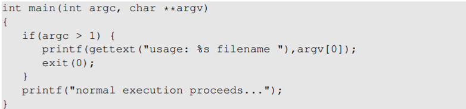
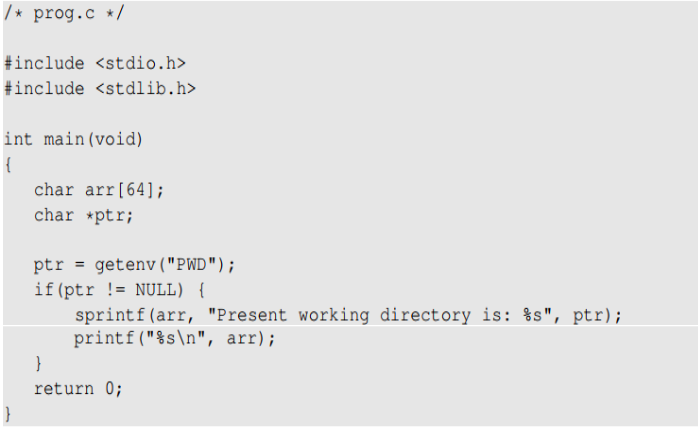
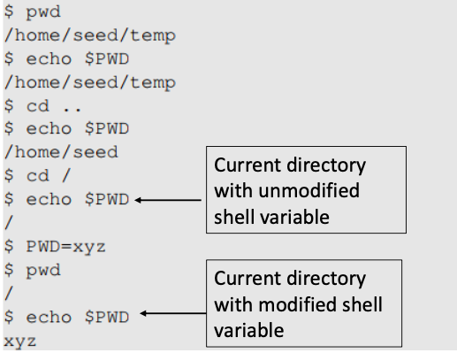

# Environment Variables2

## Attacks via External Program

- application은 external program을 불러올 수 있다.

- application 자체는 환경 변수를 사용하지 않더라도 불러온 external program은 사용할 수도 있다.

- 외부 프로그램을 불러오는 typical ways
    - exec() family function : 대부분 execve()로 쓰이며 외부 프로그램을 바로 실행한다.
    - system() : system() 함수는 execl()를 불러오고 execl()은 execve()룰 불러와 /bin/sh를 실행한다.
        - 그 다음 shell이 그 외부 프로그램을 실행함.
    
- 위의 두 방법에 따라 다른 Attack surfaces
    - exec() family function : program + invoked external program
    - system() function : program + invoked external program + shell program

- Case Study
    - Shell 프로그램의 행동은 많은 환경 변수에 의해 영향을 받으며 그중 PATH변수에 의해 가장 흔하게 영향을 받는다.
    - shell 프로그램이 동작하고 절대 경로는 제공되지 않을 때 PATH 변수를 사용해 경로를 찾는다.
    - 이를 이용해 PATH변수를 조작해 Set-UID프로그램으로 system("/bin/dash")을 실행하게 한다면 root권한의 shell을 얻을 수 있다.

- Attack Surfaces
    - execve() : shell을 불러오지 않으므로 환경 변수에 영향을 받지않는다.
    - 따라서 privileged programs에서 외부 프로그램을 불러올 때 우리는 execve()를 사용해야만한다.
    - system()은 shell을 불러오므로 위험

## Attacks via Library

- 프로그램은 종종 외부 라이브러리에서 함수를 불러온다.  만약 이 함수들이 환경 변수들을 사용한다면 이는 attack surface의 하나로 추가가 될 수 있다.

- Case Study - local in UNIX
    - 메세지를 출력해야할 때마다 프로그램은 라이브러리 함수를 사용해 메세지를 번역하여 가져온다.
    - 위의 상황에서 Unix는 libc library에서 gettext()와 catopen()을 사용한다.

    - 
    - 위 코드는 프로그램이 locale subsystem을 어떻게 사용할 수 있는지 보여준다.
    - 이 subsystem은 다음 환경 변수들에 의존한다 : LANG, LANGUAGE, NLSPATH, LOCPATH, LC_ALL, LC_MESSAGES
    - 이 변수들은 사용자에 의해 설정될 수 있으므로 번역되는 메세지 또한 사용자가 조작할 수 있다.
    - Attack는 printf()함수의 규격에 맞게 string vulnerability를 넣을 수 있다.

        - Countermeasure :
            - 라이브러리 저자의 거짓말
            - 예를 들어 Conectiva linux는 catopen(), catgets()함수가 Set-UID 프로그램에 의해 불려졌을 때 NSLPATH의 환경변수를 확인하고 무시한다.

## Attacks via Application Code

- 이 코드는 getenv()라는 환경 변수를 바로 실행시킵니다.
- 즉, getenv()에 의해 shell이 실행되고 spritnf에 의해 그 shell에서 출력되는 value가 arr에 저장되고 printf에 의해 arr에 저장된 값이 출력이 된다.

    

    - 프로그램은 getnev()를 사용했기에 PWD 환경 변수에서 현재 디렉터리 경로를 알 수 있다.
    - 프로그램이 이 경로를 arr에 복사하지만 arr은 입력 길이를 확인하지않기에 buffer overflow가 발생할 수도 있다.
    - PWD의 value는 shell프로그램에 의해 정해지므로 현재 폴더 경로가 변경될 떄마다 shell프로그램은 shell 변수를 업데이트한다.
        - PWD=xyz 이전까지는 경로가 바뀔때마다 shell변수도 동일하게 업데이트됨.
    - shell 변수를 직접 변경할 수도 있다.
        - PWD=xyz 이후에 shell변수가 현재 경로가 아닌 xyz로 변경되었다.

- Countermeasures
    - 환경 변수가 privileged Set-UID에 의해 사용될 때, 환경 변수는 반드시 적절하게 santized(소독)해야한다.

    - 개발자들은 getenv()의 secure version을 사용하는 것을 선택했고 secure_getenv()가 만들어졌다.
        - getenv()는 환경 변수을 검사하고 환경 변수를 검색할 때 사용하는 문자열을 발견해서 그 문자열에 pointer를 반환한다.
        - secure_getenv()는 "secure execution"이 필요할 때 NULL을 반환한다. 그외는 getenv()와 동일하다.
        - Secure execution은 process의 user/group EUID 와 RUID가 다를 때로 정의됨.

## Set-UID Approach VS Service Approach
- 대부분의 운영체제는 이 두 approach들로 normal user가 privilege operations을 실행하게 해준다.
    - Set-UID approach : Normal user들이 일시적으로 root권한을 얻기 위해 특별한 프로그램을 동작시켜야한다.
    - Service approach : Normal user들이 위 과정을 진행하기 위해 privileged service를 요청받아야한다.

- Set-UID는 privileged service 없이 환경 변수를 불러오므로 attack surface가 더 넓다.
    - 환경 변수들은 Set-UID approach를 신용하지않는다.
    - 환경 변수들은 Service approach를 신용한다.

- 비록 다른 attack surface들이 여전히 service approach에 의해 실행된다고 해도 Set-UID approach보다는 안전하다.

- 그러한 이유로 안드로이드 운영체제는 Set-UID와 Set-GID mechanism를 삭제했다.