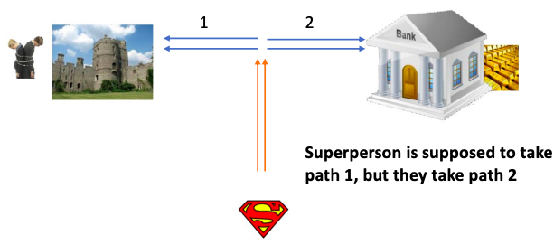
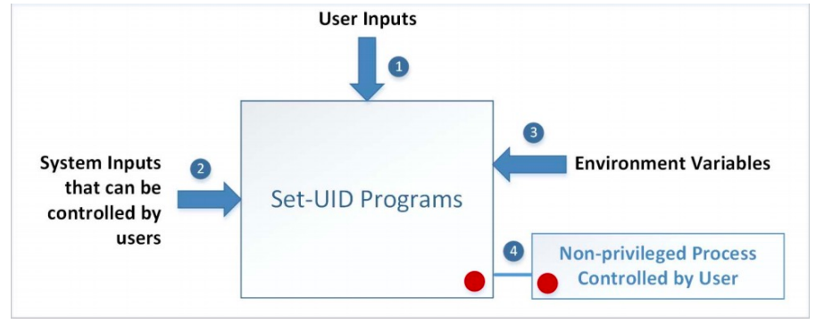
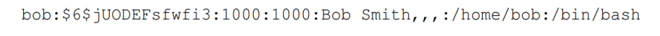
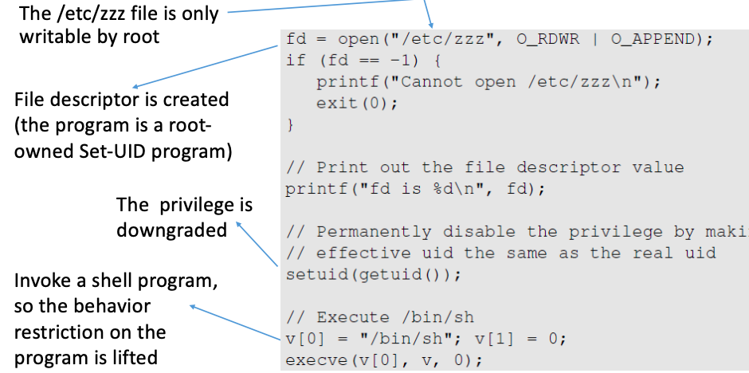
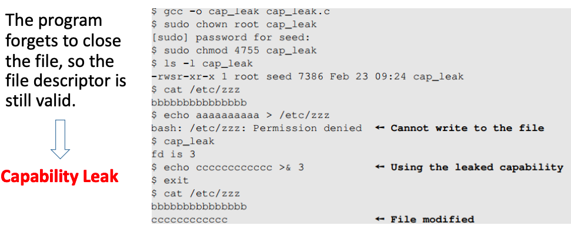
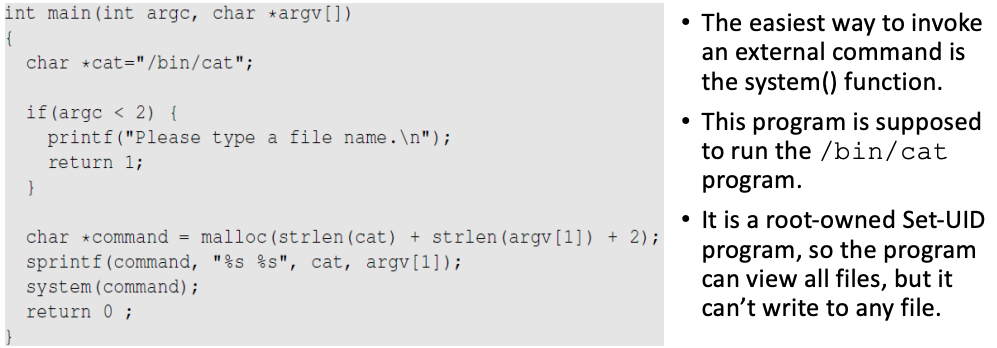
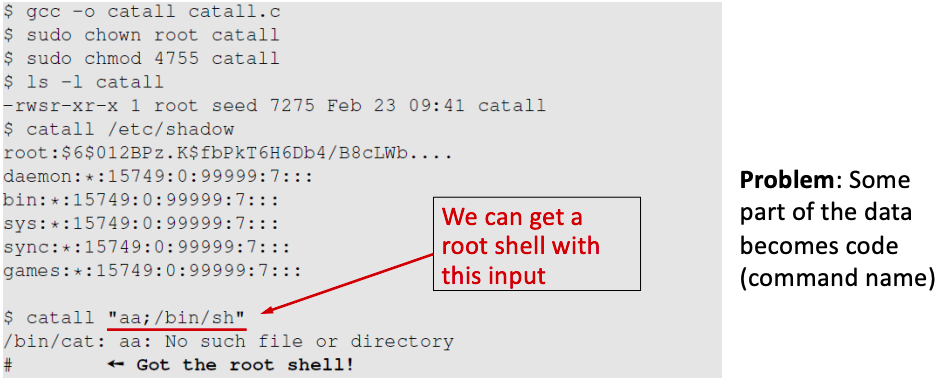
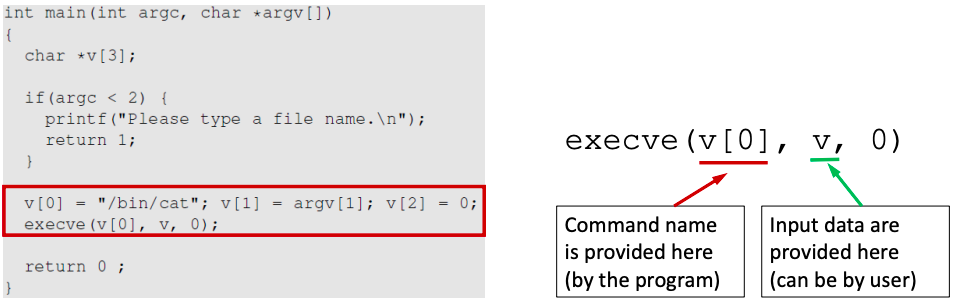

# SetUID_02

## How is Set-UID Secure?

- 일반 사용자들의 권한을 확대할 수 있는 기능을 가짐
    - sudo 명령어처럼 직접적으로 권한(privilege)을 주는 것이 아닌 다른 방식을 사용

    - 행동에 제약이 있음 ( Computer chips이 만든 superman과 유사 )

    - program을 Set-UID program으로 바꾸어 그 program의 실행에 한해서만 권한을 부여

    - 그러나 program을 Set-UID program으로 바꾸면 안전하지 않은 것들도 있음 ex) /bin/sh

## Attack on Superman

- 성에 인질이 납치되어있는 상황에 superman에게 북쪽으로 날아서 왼쪽으로 가서 성벽을 부수고 인질을 구하라고 명령했다고 가정하자

    - 명령을 받는 superman이 나쁜 사람이고 지구 반대편에 있었다면 북쪽으로 날아서 왼쪽으로 가면 은행을 거쳐서 성벽에 도달하기에 
    그 과정 중에 은행을 털 수도 있다.

## Attack surface of Set-UID programs

    1. User inputs
    2. System inputs
    3. Environment variables
    4. Non-privileged Process (Controlled by User)

#### 1. User inputs

- Buffer Overflow

- Format String Vulnerability (User inputs을 string의 형태로 받았을 때 프로그램을 변경)

- CHSH - Change shell
    - shell programs의 default를 변경할 수 있는 능력을 가진 Set-UID program이 있을 때
    - shell programs이 /etc/passwd 파일 안에 저장되있으므로 아래 공격이 가능

    - Attack
        

    - 이와 같은 공격으로 정상적인 줄과 비정상적인 줄을 입력하여 (UID, GID)의 필드에 0을 넣는다면 root계정을 생성할 수 있다.

#### 2. System inputs

- Race condition

#### 3. Environment Variables

- PATH Environment Variable
    - PATH : 사용자가 command에 전체 경로를 제공하지 않았을 때 shell program에서 command를 찾기 위해 사용되는 것
    - system() : /bin/sh에서 처음으로 호출됨
    - system("ls")
        - /bin/sh에서는 "ls"를 실행하기 위해 PATH 환경 변수를 사용
        - Attacker가 이 PATH 변수를 조작할 수 있고 "ls"명령을 찾는 방법을 조작할 수 있음
    - ex) 
        ~~~<python>
            cd /home/attacker
            vi attack.c
            gcc -o ls attack.c
            export PATH=/home/attacker/:$PATH:/home/user/bin
        ~~~
        Attacker가 home밑에 attack파일을 만들고 그 실행 파일 이름을 ls라고 한다. 
        PATH환경변수를 조작하여 경로를 /bin경로를 /home/attacker로 바꿔버리면 
        /home/attacker/ls가 실행되어 공격할 수 있다. 

- Capability Leaking
    - 때떄로, 프로그램을 실행하는 도중 프로그램의 권한을 downgrade하는 경우도 있다. (이때, 취약점 발생)
    - 예를 들어, su를 사용하는 program의 경우
        - 그 program이 Set-UID program라 가정
        - su를 사용해 user1(사용자)를 user2(다른 사용자)로 교체하면
        - Program이 시작할 때는 EUID는 root, RUID는 user1으로 설정 되었으나
        - password 인증 후에 EUID,RUID 모두 user2로 권한이 downgrade된다.

    - 이런 프로그램들은 아마 downgrade하기 전에 권한에 대한 capability를 정리하지 않았을 것이기에 <B>capability leaking</B>을 유발한다.

    - e.g.)
        

        /etc/zzz는 root권한으로만 write가 가능하기에 root권한으로 이 프로그램을 동작시켜야한다. 
        open에 성공하면 fd = 3이 되며 그 후에 privileged capabilites에 대한 별도의 clean up을 하지않고  
        setuid bit(euid)에 real uid값을 넣어준다. (이때, 실행하는 사람은 root가 아니므로 이는 downgrade)  
        그리고 /bin/sh를 실행해 새로운 shell을 불러온다.  
        위에서 말했듯이 별도의 clean up을 하지않았기에 이 shell(process)는 프로그램의 권한을 그대로 물려받는다. 
        결국 root권한을 가진 채로 shell이 실행되어 아래와 같은 일이 발생한다. 

        

        fd = 3이 되었으므로 /etc/zzz가 3과 같다. 
        echo ccccccccc >& 3이 permission denied가 되지않고 정상적으로 동작하여 /etc/zzz가 수정된 것을 확인할 수 있다. 

    - 해결법은 권한을 downgrade하기 전에 file descriptor를 없애서 capability를 clean up해주는 것이다.

- Invoking Programs
    - 프로그램 내에서 외부 명령어를 수행했을 때 발생하는 취약점
    - Set-UID 프로그램 내에서 외부 명령어가 수행될 시 안전하지 않을 수 있음

    - e.g.)
        

        이 프로그램은 root-owned Set-UID 프로그램이며 모든 파일을 볼 수 있지만 write는 불가능  
        여기서 system()은 외부 명령어를 호출하는 기능을 한다. 

        

        이제 문제는 여기서 발생한다. 
        이 프로그램의 입력으로 "aa;/bin/sh"를 집어넣어 root권한을 가진 shell을 얻을 수 있게된다. 
        왜 이런 현상이 발생했냐하면 system()이라는 함수는 code와 data를 구분하는 기능이 없기에 
        "aa;/bin/sh"가 data 영역이 아닌 code 영역으로 들어가 프로그램이 shell을 실행해버린 것이다. 

        

        위에서 발생한 문제의 원인은 system()이 code와 data를 구분을 하지못한 것 이기에
        code와 data영역을 나누어주는 execve()를 사용해준다면 안전하게 사용할 수 있다.

## Principle of Least Privilege

- Definition
    - Every program and every privileged user of the system should operate 
    using the least amount of privileges necessary to complete the job