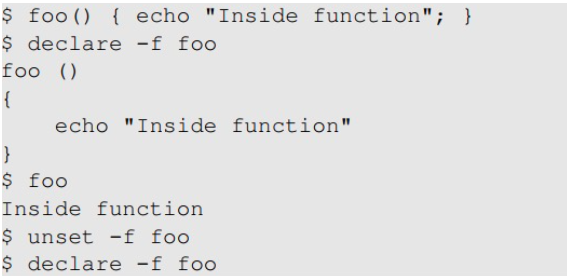
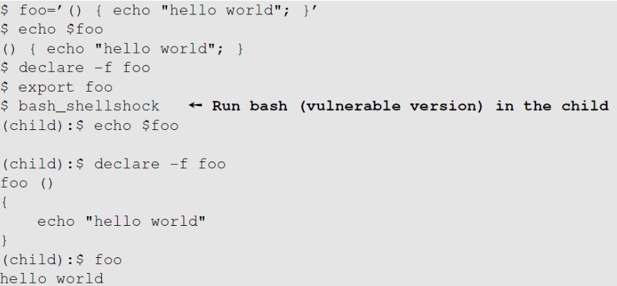
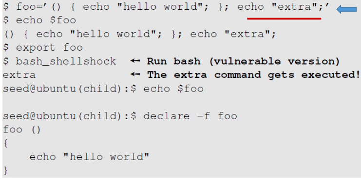
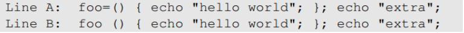
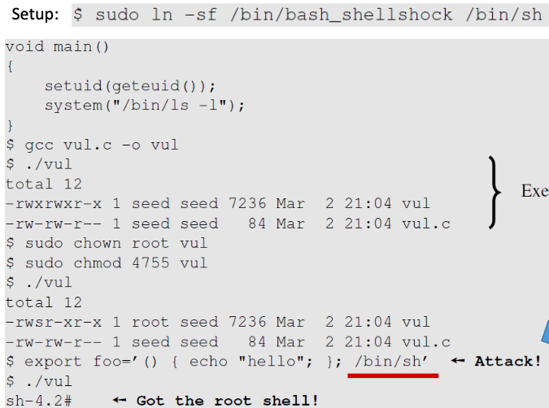
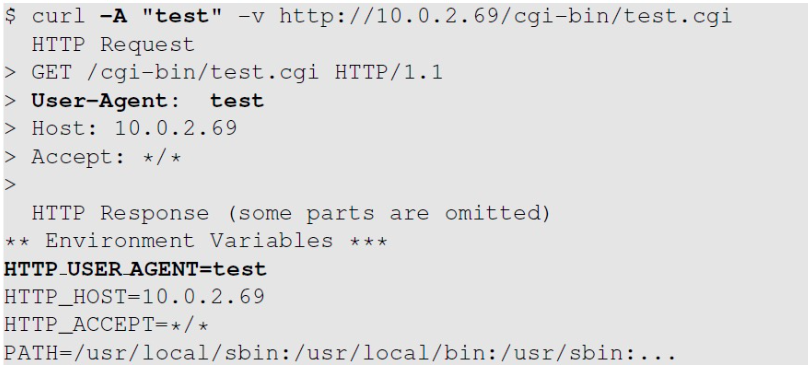
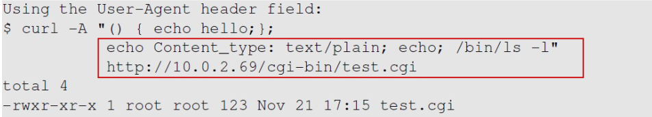

# Shellshock

## Background : Shell Functions

- Shell program : 운영체제에 있어서 command-line 번역 역할
    - 사용자와 운영체제 사이의 인터페이스를 제공
    - shell의 다른 유형 : sh, bash, csh, zsh, windows powershell etc

- Bash shell : Linux OS의 가장 유명한 shell program

- shellshock 취약점은 shell function에 연관됨 (아래는 shell function)
    

## Passing Shell Function to Child Process

- Shell variable을 정의하고 (foo) 이 foo를 shell function으로 지정하고  
shell function인 foo를 environment variable로 정의한다.  
후에 취약한 버젼의 bash shell로 child process를 생성한다.

- 

- 이 방식의 경우 parent process가 shell일 필요는 없으며  environment variable을 사용할 수 있는 어떠한 process든 상관없다.

## Shellshock Vulnerability

- 이 취약점(vulnerability)의 이름은 Shellshock 또는 bashdoor라고 한다.

- 이 취약점은 environment variables가 function definitons으로 변환할 때 bash에서 발생한 오류를 공격한다.

- Shellshock는 bash안에서 발견된 security bugs의 집합체를 참조한다.

- parent process는 child에게 function definition을 environment variable을 통해 전달할 수 있다.

- parsing logic의 버그로 인해 bash는 변수 안에 포함된 어떤 명령어를 실행한다.
    
    - 이 그림과 같이 { } 밖의 extra command는 child process에게 넘겨줄때 실행이 된다.

## Mistake in the Bash Source Code

- shellshock bug는 bash source code의 variables.c 파일 안에서 시작된다

- environment variable이 정의될때 "(){"가 들어있다면 bash는 이것을 function으로 확인하고  아래 그림과 같이 "="을 " "으로 만든다.
    

- 그렇게되면 string은 두 command로 보이게되고 parse_and_execute()가 이 echo "hello world" 와 echo "extra" 두 명령어를 실행한다.

- Consequences:
    - Attacker는 그들의 명령어를 실행해 프로세스를 얻을 수 있다.
    - 그 목표가 된 프로세스가 서버 프로세스거나 privilege권한으로 동작시키는 경우 보안 침해가 발생할 수 있다.

## Exploiting the Shellshock Vulnerability

1) The target process가 bash를 실행시켜야만 한다.
2) The target process가 environment variables를 통해 신뢰할 수 없는 사용자의 입력을 받을 수 있어야한다.

- 이 2가지 조건이 취약점을 이용하는데 필요하다.

## Shellshock Attack on Set_UID Programs

- 아래 예제에서 system function()을 통해 /bin/ls 프로그램을 실행할때 Set-UID root program이 bash process를 동작시킨다.
- 그러면 공격자에 의한 environ var set이 허가받지않은 명령어들을 실행한다.

    #### Setting up the vulnerable program
    - 

## Shellshock Attack on CGI Programs

- Common gateway interface(CGI)는 웹서버의 동적으로 웹 페이지들을 생성하는 프로그램을 동작시키는데 이용된다.
- 많은 CGI프로그램들이 shell scripts를 사용하나 bash가 사용되면 shellshock공격을 받을 수 있다.

- setup
    - test.cgi라는 CGI program과 공격자용 서버와 희생자용 서버를 준비한다.
    - 이를 위해 curl을 사용한다.

## How Web Server Invokes CGI Programs

- Apache web server에 CGI URL을 보냈을 때, Apache는 그 request를 시험한다.

- 만약 CGI request라면 Apache는 fork()를 사용하여 새로운 process를 동작시키고 그 process에서 exec() 함수를 사용해 CGI program을 실행시킨다.

- test.cgi는 "#!/bin/bash"로 시작하는데 shell script를 동작시킬때 exec()가 실제로 실행시키는 부분은 /bin/bash이다.

- 즉, bash shell를 실행 시키므로써 shellshock 공격을 할 수 있다.

## How to Use Data Get Into CGI Programs

- Apache가 child process를 생성할 때, 그것은 bash programs의 모든 environ var를 제공한다.

- curl을 사용한 http request, http response를 보면 client의 data가 CGI program의 환경변수에 들어간 것을 확인할 수 있다.

- '-A'옵션을 사용하면 user-agent field를 원하는데로 바꿀 수 있다.
    

- 이와 같이 '-A' 옵션으로 environ var에 function definition을 집어넣어 shellshock 공격 가능
    

## Shellshock Attack

- Steal Passwords : web application은 백앤드 데이터베이스와 연결되어있기에 login passswd가 필요한데 이는 공격자가 curl -A를 사용해 얻어낼 수 있다.

- Reverse Shell : 공격에서 단순히 /bin/bash를 실행시키면 bash가 서버측에서 실행되지만 제어할 수가 없다. 그렇기에 필요한 것이 reverse shell이다.

    - reverse shell의 핵심은 표준 입력, 출력, error device를 network connection에 재전송하는 것이다.(redirect)
    - 이렇게되면 그 shell은 connection으로부터 입력을 받고 connection으로 출력을 할 수 있다.
    - 즉, 공격자가 어떤 명령어든 동작시킬 수 있고 그 출력을 그들의 머신으로 받을 수 있다.